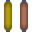

# Simple WFC

Simple wave function collapse test project implemented in Java. Creates output texture from simple tiles based on constraints defined in code, rather than the usual image based input.

Implemented: 
* Rotations in 2d
* Output texture tileability

TODO:

* Backtracking
* 3D
* Symmetries
* ...

## Test output:

### Circuits
Input tiles:

       

Output:

### Test:
Input tiles:

           

Output:

### Cross:
Input tiles:

   

Output:

## Dependencies

Displaying is done using LibGDX